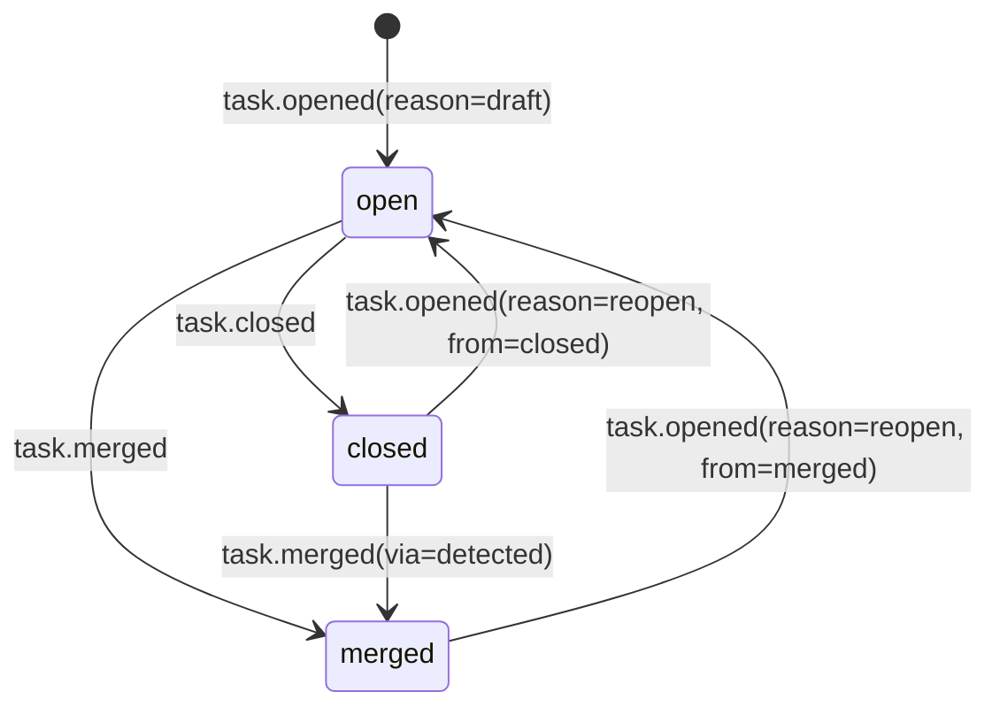

# Subtask Protocol Specification

This document specifies the on-disk data model and observable behaviors for Subtask, sufficient to implement a compatible client in another language.

Subtask is **file-based** and **git-native**:

- Durable, portable state lives in `.subtask/tasks/<task>/` (especially `history.jsonl`).
- Runtime, machine-specific state lives in `.subtask/internal/<task>/`.
- Workspaces are git worktrees under `~/.subtask/workspaces/`.

This is a **specification**, not a tutorial.

## 0. Conformance Language

The key words **MUST**, **MUST NOT**, **SHOULD**, **SHOULD NOT**, and **MAY** are to be interpreted as described in RFC 2119.

Unless otherwise stated:

- “Client” means an implementation that reads/writes Subtask task state.
- “Project” means a git repository directory tree containing a `.subtask/` directory.
- “Task” means a named unit of work identified by a task name and represented by a task folder on disk.

## 1. Identifiers and Path Mapping

### 1.1 Task Name

A task is uniquely identified by its **task name** (e.g. `fix/epoch-boundary`).

#### Requirements

- A task name **MUST** be a valid git branch name (i.e. a refname suitable for `refs/heads/<task>`).
- For portable folder mapping (Section 1.2) to be reversible, task names **SHOULD NOT** contain the substring `--`.
  - Note: current implementations do not strictly enforce this; clients that want full interoperability **SHOULD** enforce it to prevent ambiguous mapping.

### 1.2 Task Folder Name (EscapeName)

Subtask stores task folders under `.subtask/tasks/` using an escaped representation:

- `EscapeName(name)` is defined as `name` with all `/` replaced by `--`.
- `UnescapeName(escaped)` is defined as `escaped` with all `--` replaced by `/`.

Example:

- Task name `fix/epoch-boundary` maps to folder `.subtask/tasks/fix--epoch-boundary/`.

### 1.3 Project Root Discovery

The “project root” is the directory containing `.subtask/` (not `.subtask` itself).

A client **MUST** treat the nearest `.subtask/` directory found at or above the current working directory as the active project. If none exists, the project root is the current working directory and `.subtask/` is treated as absent until created.

### 1.4 Workspace Pool Prefix (EscapePath)

Workspace directories are named using an escaped project-root path:

```
~/.subtask/workspaces/<escaped-project-root>--<id>/
```

`escaped-project-root` is computed as:

1. Convert the project root path to an absolute path.
2. Resolve filesystem symlinks (to normalize paths such as `/var/...` vs `/private/var/...` on macOS).
3. Replace:
   - OS path separator characters with `-`
   - `:` with `-` (for Windows drive letters)
   - Windows-invalid filename characters `< > " | ? *` with `-`

The workspace `<id>` is a positive integer.

## 2. Data Model

### 2.1 Overview

Subtask consists of:

- **Portable task folders** under `.subtask/tasks/`
- **Runtime task state** under `.subtask/internal/`
- A **workspace pool** of git worktrees under `~/.subtask/workspaces/`
- An optional **SQLite index** `.subtask/index.db` used as a cache (non-authoritative)

### 2.2 Task Folder Layout (Portable)

For a task name `<task>`, the portable folder is:

```
.subtask/tasks/<EscapeName(task)>/
  TASK.md           (required)
  history.jsonl     (required; append-only event log)
  WORKFLOW.yaml     (optional but typical; workflow definition)
  PLAN.md           (optional; Markdown)
  PROGRESS.json     (optional; JSON array of steps)
  ...               (optional; arbitrary shared files)
```

All files in the task directory are considered **shared** between lead and worker, except where a client imposes additional guardrails.

### 2.3 Internal State Layout (Runtime-only)

For a task name `<task>`, runtime state may exist at:

```
.subtask/internal/<EscapeName(task)>/
  state.json        (optional; runtime state)
  progress.json     (optional; runtime metrics)
  op.lock           (required for locking when present; lock file)
.subtask/internal/workspace.lock  (global lock for workspace allocation)
.subtask/index.db                 (optional cache)
```

Internal state files are **not portable** and **MUST NOT** be treated as authoritative when they conflict with `history.jsonl`.

## 3. File Formats

### 3.1 `.subtask/config.json` (Project Config)

`config.json` is a UTF-8 JSON document.

#### Schema (conceptual)

```json
{
  "harness": "codex|claude|opencode|...",
  "max_workspaces": 20,
  "options": {
    "model": "string (optional)",
    "reasoning": "low|medium|high|xhigh (codex-only, optional)",
    "...": "implementation-defined"
  }
}
```

#### Semantics

- `harness` selects the worker backend.
- `max_workspaces` is the maximum number of workspaces created on demand for this project.
- `options` is a free-form object; unknown keys **MUST** be ignored by compatible clients.

### 3.2 `TASK.md` (Task Definition)

`TASK.md` is a UTF-8 text file with:

1. A YAML frontmatter block delimited by `---` lines
2. An optional Markdown body (task description)

#### Syntax

```
---\n
<YAML>\n
---\n
\n?
<description markdown...>
```

#### Frontmatter Keys

| Key | Type | Required | Meaning |
|---|---:|---:|---|
| `title` | string | yes | Human-friendly short title |
| `base-branch` | string | yes | Base branch name (local branch, e.g. `main`) |
| `schema` | int | no | Task schema version (current: `1`) |
| `follow-up` | string | no | Context reference to continue from (typically a task name; may also be a raw harness session ID) |
| `model` | string | no | Default model override for this task |
| `reasoning` | string | no | Default reasoning override (codex-only) |

Unknown keys **MUST** be ignored.

#### Body Semantics

The body (after frontmatter) is arbitrary Markdown. Clients **MAY** treat it as contextual description and **MUST NOT** interpret it as the operational prompt unless explicitly specified by the user.

### 3.3 `WORKFLOW.yaml` (Workflow Definition)

`WORKFLOW.yaml` is a UTF-8 YAML document defining a workflow and its stages.

#### Schema (conceptual)

```yaml
name: string
description: string
instructions:
  lead: string   # optional markdown
  worker: string # optional markdown
stages:
  - name: string
    instructions: string # optional markdown
```

#### Semantics

- `stages` **MUST** contain at least one stage.
- Stage order is significant: it defines the progression displayed to the user.
- A task “has a workflow” if and only if `WORKFLOW.yaml` exists in the task directory.

### 3.4 `PLAN.md` (Optional Plan)

`PLAN.md` is an optional UTF-8 Markdown file. Its content is not interpreted by the protocol.

### 3.5 `PROGRESS.json` (Optional Progress Steps)

`PROGRESS.json` is an optional UTF-8 JSON document.

#### Schema

It **MUST** be a JSON array of objects:

```json
[
  {"step": "string", "done": false},
  {"step": "string", "done": true}
]
```

#### Semantics

- This file is informational. If missing or invalid, clients **SHOULD** treat it as empty.
- Step ordering is the array order.

### 3.6 `history.jsonl` (Durable Event Log)

`history.jsonl` is the **portable source of truth** for durable task state.

#### Encoding

- UTF-8
- JSON Lines (one JSON object per line)
- Newlines may be `\n` or `\r\n` on disk; readers **MUST** accept both.

#### Event Envelope

Each line is a JSON object with this envelope:

```json
{
  "ts": "RFC3339 timestamp (recommended UTC)",
  "type": "string",
  "role": "lead|worker (messages only, optional)",
  "content": "string (messages only, optional)",
  "data": { "any": "json" } // optional, type-specific
}
```

Rules:

- `type` **MUST** be present and non-empty.
- If `ts` is missing or zero, clients **SHOULD** treat the event as having an unknown timestamp and preserve file order.
- `data` is type-specific; unknown fields inside `data` **MUST** be ignored.
- The log is append-only. Clients **MUST NOT** rewrite existing lines except during explicit migration (Section 7.5).

#### Standard Event Types

##### 3.6.1 `task.opened`

Represents task creation (draft) or reopening.

`data` is an object with:

| Field | Type | Required | Notes |
|---|---:|---:|---|
| `reason` | string | yes | `draft` or `reopen` |
| `branch` | string | yes | Task branch name; normally equals task name |
| `base_branch` | string | yes | Base branch name |
| `base_ref` | string | no | Base ref used for resolving `base_commit` (often equals `base_branch`) |
| `base_commit` | string | no | A commit SHA pinned at open/reopen time |
| `workflow` | string | no | Workflow name (not the file contents) |
| `title` | string | no | Human title snapshot |
| `follow_up` | string | no | Follow-up context string (typically a task name; may be a raw session ID) |
| `model` | string | no | Model snapshot |
| `reasoning` | string | no | Reasoning snapshot |
| `from` | string | no | Present when `reason=reopen`; prior task status (`merged` or `closed`) |

##### 3.6.2 `stage.changed`

Represents a workflow stage transition.

`data` is an object with:

| Field | Type | Required |
|---|---:|---:|
| `from` | string | no |
| `to` | string | yes |

##### 3.6.3 `message`

Represents a conversation message.

Envelope fields:

| Field | Required |
|---|---:|
| `role` | yes |
| `content` | yes |

Rules:

- `role` **SHOULD** be `lead` or `worker`.
- Clients **SHOULD NOT** append empty worker messages; an empty worker reply is treated as an error outcome (see `worker.finished`).

##### 3.6.4 `worker.started`

Represents the start of a worker run.

`data` is an object with:

| Field | Type | Required |
|---|---:|---:|
| `run_id` | string | yes |
| `prompt_bytes` | int | no |

`run_id` correlates `worker.started`, `worker.interrupt`, and `worker.finished`.

##### 3.6.5 `worker.session`

Represents session lifecycle events (start/migration/follow-up seeding).

`data` is an object with:

| Field | Type | Required |
|---|---:|---:|
| `action` | string | yes | `started`, `migrated`, or `follow_up` |
| `harness` | string | yes | e.g. `codex`, `claude`, `opencode` |
| `session_id` | string | yes |
| `from_task` | string | no | Present when `action=follow_up`; task name referenced by `TASK.md` `follow-up` |
| `from_session` | string | no | Present when `action=follow_up`; original session ID before duplication/fallback |

##### 3.6.6 `worker.interrupt`

Represents interruption requests and receipts.

`data` is an object with:

| Field | Type | Required |
|---|---:|---:|
| `action` | string | yes | `requested` or `received` |
| `run_id` | string | no | Best-effort correlation |
| `signal` | string | yes | e.g. `SIGINT`, `SIGTERM` |
| `supervisor_pid` | int | yes |
| `supervisor_pgid` | int | no | Unix-only |

##### 3.6.7 `worker.finished`

Represents completion of a worker run.

`data` is an object with:

| Field | Type | Required | Notes |
|---|---:|---:|---|
| `run_id` | string | yes | Matches `worker.started` |
| `duration_ms` | int | no | Duration in milliseconds |
| `tool_calls` | int | no | Count of tool calls seen |
| `outcome` | string | yes | `replied` or `error` |
| `error_message` | string | no | Present when `outcome=error` |
| `error` | string | no | Legacy/alternate error field |
| `inferred` | bool | no | Used for migrated/inferred events |

If `outcome=error`, clients **SHOULD** set `error_message` (or `error`) to a non-empty string.

##### 3.6.8 `task.closed`

Represents a task being closed without merging.

`data` is an object with:

| Field | Type | Required |
|---|---:|---:|
| `reason` | string | no | `close` or `abandon` |

##### 3.6.9 `task.merged`

Represents a task being marked merged.

`data` is an object with:

| Field | Type | Required | Notes |
|---|---:|---:|---|
| `commit` | string | no | Merge/squash commit SHA (may be missing for inferred migrations) |
| `into` | string | no | Base branch name |
| `branch` | string | no | Task branch name (normally task name) |
| `merge_base` | string | no | Merge-base SHA used for squash |
| `trailers` | object | no | Map of commit trailer keys to values |
| `via` | string | no | When present and `detected`, indicates automatic detection (Section 6.6) |
| `integrated_reason` | string | no | Detection reason enum (implementation-defined) |
| `branch_head` | string | no | Observed task-branch head at detection time |
| `target_head` | string | no | Observed base-branch head at detection time |
| `inferred` | bool | no | Migration/inference flag |
| `inference` | string | no | Migration/inference explanation |

### 3.7 `.subtask/internal/<task>/state.json` (Runtime State)

`state.json` is a UTF-8 JSON document.

#### Schema (conceptual)

```json
{
  "workspace": "/abs/path/to/workspace",
  "session_id": "string",
  "harness": "codex|claude|opencode|...",
  "supervisor_pid": 12345,
  "supervisor_pgid": 12345,
  "started_at": "RFC3339 timestamp (UTC recommended)",
  "last_error": "string"
}
```

#### Semantics

- `workspace` is the bound workspace path for the task on this machine.
- `supervisor_pid` is non-zero while a local `send` is actively supervising a worker run.
- `last_error` is a best-effort record of the latest local error.
- `session_id` is a harness session identifier used to continue context across runs.

Clients **MUST NOT** infer durable task status (open/closed/merged) from this file.

### 3.8 `.subtask/internal/<task>/progress.json` (Runtime Metrics)

This file is optional, runtime-only, and informational.

Schema (conceptual):

```json
{
  "tool_calls": 12,
  "last_activity": "RFC3339 timestamp"
}
```

### 3.9 `conversation.txt` (Deprecated)

Older versions of Subtask wrote conversation history to `conversation.txt`. Current versions do not write it, and do not use it for status/session recovery.

If a `conversation.txt` file exists in a task folder:

- Clients **MAY** ignore it entirely.
- Clients **MUST NOT** treat it as authoritative over `history.jsonl`.

## 4. State Derivation and State Machines

Subtask’s durable state is derived from `history.jsonl`; runtime state comes from `state.json`.

### 4.1 Durable Task Status

Task status is derived by scanning `history.jsonl` backwards and selecting the most recent status event:

- If the most recent status event is `task.closed`, the task status is `closed`.
- Else if it is `task.merged`, the task status is `merged`.
- Else if it is `task.opened`, the task status is `open`.
- If no status event exists but `history.jsonl` exists, status defaults to `open`.

This implies a valid transition **closed → merged** if a `task.merged` event is appended after a `task.closed` event (e.g. via detection).

### 4.2 Worker Status (Local)

Worker status is derived as follows:

1. If `state.json.supervisor_pid != 0` and the PID is alive, worker status is `running`.
2. Else if `state.json.last_error` is non-empty, worker status is `error`.
3. Else, scan `history.jsonl` backwards for the most recent `worker.finished`:
   - If `outcome=error`, worker status is `error`.
   - If `outcome=replied`, worker status is `replied`.
   - Otherwise (or absent), worker status is `not_started`.

### 4.3 Workflow Stage

The current stage is:

- The `to` field of the most recent `stage.changed` event, if present.
- Otherwise, if a workflow exists, the first stage in `WORKFLOW.yaml`.
- Otherwise, empty/unknown.

Stages do not auto-advance; they change only via `stage.changed` events.

### 4.4 State Transitions (Mermaid)



### 4.5 Concurrency and Locking

To avoid concurrent modification:

- A client that mutates a task’s portable state **MUST** take an exclusive per-task lock at `.subtask/internal/<task>/op.lock`.
- A client that allocates workspaces **MUST** take an exclusive lock at `.subtask/internal/workspace.lock` while selecting/creating a workspace.

The lock mechanism is implementation-defined, but it **MUST** provide cross-process mutual exclusion on the local machine (e.g. `flock` on Unix, `LockFileEx` on Windows).

## 5. Git Integration

### 5.1 Branch Naming

The task branch name is exactly the task name.

- Task `fix/epoch-boundary` uses git branch `fix/epoch-boundary`.
- No escaping is applied at the git level.

### 5.2 Workspace Model

Workspaces are git worktrees created from the project root repository and stored in a shared pool at:

```
~/.subtask/workspaces/<escaped-project-root>--<id>/
```

Each workspace is a detached worktree by default (not permanently bound to a branch).

### 5.3 Binding a Task to a Workspace

On the local machine, a task may be bound to at most one workspace at a time via `state.json.workspace`.

While bound:

- The workspace is considered **occupied** and is not reused for other tasks.
- The client **SHOULD** ensure the task folder is accessible from the workspace via a symlink:

```
<workspace>/.subtask/tasks/<EscapeName(task)> -> <project>/.subtask/tasks/<EscapeName(task)>
```

### 5.4 Base Commit Pinning

On `task.opened(reason=draft)` a client **SHOULD** record a `base_commit` representing the resolved commit SHA of the base ref at draft time.

This pinned commit is used to:

- Create stable diffs
- Provide best-effort “commits behind” / conflict warnings
- Create the task branch from a stable base when first starting a task

### 5.5 Creating or Reusing a Task Branch on `send`

When starting a task in a workspace:

- If the task is `merged`, the client **MUST** create a new branch from base (do not reuse an existing task branch).
- Else if the task branch exists, the client **SHOULD** check it out.
- Else, the client **SHOULD** create it from `base_commit` if available; otherwise from the base branch HEAD.

### 5.6 Merge Semantics (`merge`)

The canonical merge operation is a **squash + rebase + fast-forward update** of the local base branch:

1. Require the task workspace to be clean (no uncommitted changes).
2. Compute merge-base between base branch and task `HEAD`.
3. Preflight conflicts:
   - Simulate a merge between the base branch tip and the task branch tip, and detect whether the merge would conflict.
   - If conflicts are detected, the merge operation **MUST** fail without rewriting the task branch (i.e., before squashing).
4. Ensure there is at least one commit in `mergeBase..HEAD` (otherwise “no commits to merge”).
5. Create a squash commit by soft-resetting to merge-base and committing all changes.
6. Rebase the task branch onto the local base branch (abort on conflicts).
7. Fast-forward update the base branch in the main repo via a local push.
8. Detach the workspace `HEAD` and delete the task branch.
9. Append `task.merged` to `history.jsonl` and clear `state.json.workspace` (free workspace).

Clients **SHOULD** include a `Subtask-Task: <task>` trailer in the squash commit message.

### 5.7 Close Semantics (`close`)

Closing a task:

- Requires the task not be actively running.
- If `--abandon` is specified, uncommitted changes in the task workspace are discarded (hard reset + clean).
- Otherwise, uncommitted changes prevent closing.

On close:

- Detach workspace `HEAD` (best-effort).
- Optionally delete the task branch if it contains no unique commits relative to the base branch.
- Append `task.closed` to `history.jsonl`.
- Clear `state.json.workspace` (free workspace) and related runtime fields.

### 5.8 External Integration Detection (Promotion of Closed → Merged)

Subtask may automatically append `task.merged(via=detected)` for tasks that are **closed** and whose branch is detected as integrated into the base branch.

Detection is an optimization and may be performed as a side effect of “read” operations such as `list` or `show`.

Separately, clients may compute and cache an “integrated” indicator for display purposes (e.g. to show that a task branch appears merged even if the task was not explicitly `merge`d). Such cached indicators are non-portable and **MUST NOT** be treated as durable status.

#### Detection Inputs

- Task name `T`
- Base branch `B` from durable task state (`task.opened.data.base_branch`)
- Refs snapshot from:
  - `refs/heads/<T>`
  - `refs/heads/<B>`
  - `refs/remotes/origin/<B>` (if present)

The effective base ref is:

- `origin/<B>` if the repository has `origin/<B>` and the local `<B>` is an ancestor of `origin/<B>`.
- Otherwise `<B>`.

#### Detection Checks

Given:

- `branchHead = HEAD(refs/heads/<T>)`
- `targetHead = HEAD(effectiveBaseRef)`
- `targetTree = targetHead^{tree}`

The branch is considered integrated if either:

1. `branchHead` is an ancestor of `targetHead` (history-preserving merge), OR
2. A simulated merge produces no content changes:
   - `mergeTree = git merge-tree --write-tree targetHead branchHead`
   - integrated if `mergeTree == targetTree`

#### Promotion Rule

If a task’s durable status is `closed` and the branch is integrated, a client **MAY** append:

- `task.merged` with:
  - `via: "detected"`
  - `commit: targetHead`
  - `into: <base_branch>`
  - plus optional diagnostic fields (`integrated_reason`, `branch_head`, `target_head`)

This changes durable status to `merged` (Section 4.1).

## 6. Operations

This section defines Subtask operations in terms of preconditions and observable effects on disk, `history.jsonl`, and git state. Output formatting is out of scope.

### 6.1 `init` (Initialize Project)

Effects (project-local):

- Create or overwrite `.subtask/config.json`.
- Ensure `.subtask/` exists.
- Optionally update `.gitignore` to include `.subtask/`.

No tasks are created.

### 6.2 `draft` (Create a Task)

Preconditions:

- Task name does not already exist as `.subtask/tasks/<task>/TASK.md`.
- Base branch resolves to a local commit in the project repository.

Effects:

- Create `.subtask/tasks/<task>/TASK.md`.
- Create `.subtask/tasks/<task>/WORKFLOW.yaml` (copy selected workflow template) if absent.
- Create `.subtask/tasks/<task>/history.jsonl` with:
  1. `task.opened(reason=draft, base_branch, base_commit, ...)`
  2. `stage.changed(from="", to=<first-stage>)`

No workspace is allocated and no `state.json` is required.

### 6.3 `send` (Run Worker for a Task)

Preconditions:

- Task exists (`TASK.md`).
- Project config exists (`config.json`).
- If `state.json.supervisor_pid` indicates an active run, `send` **MUST** fail (no concurrent runs per task per machine).

Effects (high level):

1. Ensure task schema is current (migration may create `history.jsonl` if absent).
2. Acquire or reuse a workspace and check out the appropriate task branch (Section 5.5).
3. Ensure the task folder is symlinked into the workspace (Section 5.3).
4. If `TASK.md` `follow-up` is set and no session is currently associated with this task:
   - Resolve the follow-up seed:
     1. If the follow-up value matches an existing task:
        - Prefer `state.json.session_id` and `state.json.workspace` from that task (when present).
        - Otherwise, fall back to the most recent `worker.session` event in that task’s `history.jsonl`.
     2. If the follow-up value does not match an existing task, treat it as a raw harness session ID.
   - If the seed’s harness is known and differs from the project harness, `send` **MUST** fail (sessions are not compatible across harnesses).
   - Choose the session ID to run with:
     - If the harness supports session duplication, duplicate the seed session into the new workspace and use the duplicated session ID.
     - Otherwise, fall back to resuming the original seed session ID (this may mutate the original session history).
     - For harnesses whose sessions are stored under a cwd-scoped project directory (e.g. Claude Code), duplication is required; if duplication cannot be performed, `send` **MUST** fail.
5. Update `state.json` to record:
   - bound workspace
   - supervisor PID / start time
   - harness name
   - chosen `session_id` (if any)
6. If a follow-up session was chosen in step 4, append `worker.session(action=follow_up, ...)` and persist the chosen `session_id` to `state.json`.
7. Append to `history.jsonl` (same timestamp recommended):
   - `message(role=lead, content=<prompt>)`
   - `worker.started(run_id, prompt_bytes)`
8. Run the configured harness:
   - On session start: append `worker.session(action=started, harness, session_id)` and persist `state.json.session_id`.
   - For each observed tool call: update `.subtask/internal/<task>/progress.json` (informational).
9. On completion:
   - If success: append `message(role=worker, content=<reply>)` then `worker.finished(outcome=replied, ...)`.
   - If error: append `worker.finished(outcome=error, error_message, ...)`.
10. Clear “running” fields in `state.json` (PID/PGID/start time), while typically retaining `workspace` and `session_id` for follow-ups.

Reopen rule:

- If durable status is not `open` when a new workspace is acquired for the task, `send` **SHOULD** append `task.opened(reason=reopen, from=<prior-status>, base_commit=<HEAD>)`.

### 6.4 `stage` (Set Workflow Stage)

Preconditions:

- Task has `WORKFLOW.yaml`.
- Target stage exists in the workflow’s stage list.
- Task is not actively running (`state.json.supervisor_pid == 0` or stale).

Effects:

- Append `stage.changed(from=<current>, to=<requested>)` to `history.jsonl`.

### 6.5 `interrupt` (Gracefully Stop a Running Task)

Preconditions:

- Task exists and `state.json.supervisor_pid != 0` (running).

Effects:

- Append `worker.interrupt(action=requested, signal=SIGINT, supervisor_pid, supervisor_pgid?, run_id?)`.
- Send an interrupt signal to the supervisor (process-group preferred when available).
- The supervisor, upon receiving the signal, appends:
  - `worker.interrupt(action=received, ...)`
  - `worker.finished(outcome=error, error_message="interrupted", ...)`
  and clears its running fields in `state.json`.

### 6.6 `diff` (Show Task Diff)

This operation is observational and has no required side effects.

Behavior:

- If a workspace is bound and exists, diff from the workspace (including uncommitted changes).
- Otherwise diff from git refs (`base..taskBranch`).
- For merged tasks whose branch no longer exists, clients **MAY** show the diff for the merge commit recorded in `task.merged.data.commit`.

### 6.7 `close` (Close Task, Free Workspace)

See Section 5.7 for semantics.

Durable effect:

- Append `task.closed` to `history.jsonl`.

Runtime effect:

- Clear `state.json.workspace` (and session/run fields), freeing the workspace for other tasks.

### 6.8 `merge` (Squash-Merge Task, Mark Merged, Free Workspace)

See Section 5.6 for semantics.

Durable effect:

- Append `task.merged` to `history.jsonl`.

Runtime effect:

- Clear `state.json.workspace` (and session/run fields), freeing the workspace for other tasks.

### 6.9 `workspace` (Print Bound Workspace Path)

Behavior:

- If `state.json` exists and contains `workspace`, return it.
- Otherwise fail (drafted-but-never-run tasks have no bound workspace).

### 6.10 `list` / `show` (Observation)

These operations primarily read task state.

Important: a client **MAY** perform integration detection during these operations and append `task.merged(via=detected)` for eligible tasks (Section 5.8). Therefore, “read” operations are not strictly side-effect free.

### 6.11 `log` (Observation)

`log` reads `history.jsonl` and formats it. It has no required side effects beyond optional schema migration when `history.jsonl` is missing/empty for an older task (Section 7.5).

### 6.12 `review` (Harness-Specific Review)

Behavior:

- Requires a bound workspace.
- Runs a harness-specific review command against the workspace.

No portable state changes are required.

### 6.13 `ask` (No-Task Session)

`ask` does not operate on tasks. It runs the harness in the current working directory and stores session transcripts under:

```
~/.subtask/conversations/<petname>.txt
~/.subtask/conversations/<petname>.uuid
```

This is outside the task protocol and does not affect `.subtask/tasks/`.

### 6.14 `install` / `uninstall` / `status` / `update`

These operations manage local installation state (skills/plugins and binary updates). They are outside the task protocol and are not required for a compatible task client.

## 7. Portability and Recovery

### 7.1 Portability Contract

Portable:

- `.subtask/tasks/<task>/` (including `TASK.md`, `WORKFLOW.yaml`, `history.jsonl`, and any shared files)

Runtime-only (non-portable):

- `.subtask/internal/<task>/` (workspace path, PIDs, session IDs, locks, runtime metrics)
- `.subtask/index.db` (cache)
- `~/.subtask/workspaces/` (worktree pool)

### 7.2 Rebuilding Derived State

If `.subtask/index.db` is missing or corrupted, clients **SHOULD** rebuild it from task folders and `history.jsonl`. Loss of the index **MUST NOT** cause loss of durable task state.

### 7.3 Crash / Staleness Recovery

If a task’s `state.json.supervisor_pid` exists but the process is dead:

- The client **SHOULD** clear `supervisor_pid`, `started_at`, and record a best-effort `last_error` (e.g. “supervisor process died”).
- Durable history is unchanged; worker status becomes `error` by derivation.

### 7.4 Cross-Machine Sync

When tasks are copied between machines:

- `history.jsonl` remains authoritative for durable status.
- Missing `state.json` simply means the task has no bound workspace on that machine until a client allocates one.
- If a machine has a stale `state.json.workspace` for a task that is not durably `open`, the workspace binding **SHOULD** be cleared locally.

### 7.5 Migration (Legacy Tasks)

If `TASK.md` has a schema version lower than the current schema and `history.jsonl` is missing or empty, a client **MAY** perform a one-time migration that:

- Synthesizes an initial `task.opened` and `stage.changed`
- Infers a terminal `worker.finished` / `task.closed` / `task.merged` where possible

Migration is the only case where rewriting or bulk-writing `history.jsonl` is expected.
